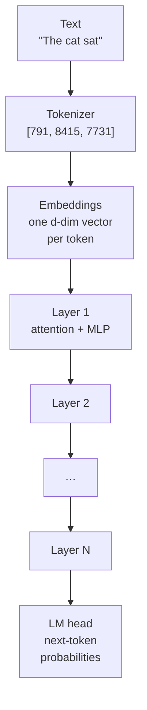
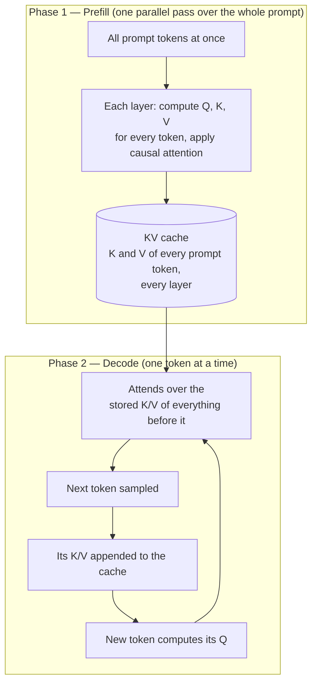
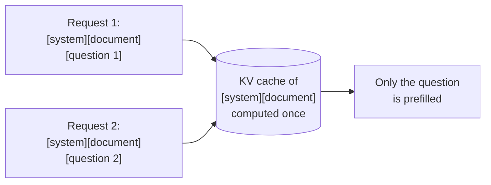
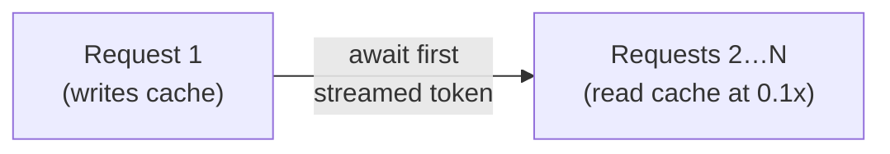

Over the past few years, along with the rapid growth of LLM-based products and services, the cost and latency of serving large language models have become critical engineering concerns. LLM APIs are stateless: every request must carry the full prompt — system instructions, tool definitions, documents, conversation history — and the model re-processes all of it from scratch, every time. In most real applications, however, the bulk of the prompt is identical across requests. A chat application re-sends the same system prompt together with a growing history every turn; a document question-answering service re-sends the same document for every question; an evaluation pipeline sends the same instructions with hundreds of different inputs.

Prompt caching addresses exactly this redundancy. It allows the provider to store the intermediate computation for a prompt prefix and reuse it when a later request starts with the same bytes. When applied correctly, cached tokens are billed at approximately 10% of the normal input price (Anthropic, Bedrock, Gemini, DeepSeek; around 50% on older OpenAI models), and the time-to-first-token on long prompts is reduced by up to 80–85%. When applied incorrectly — a timestamp interpolated in the wrong place, a batch fired in parallel, a breakpoint placed on the varying block — the savings silently fail to materialize, or the total cost even increases.

In this article, I am going to summarize the practical guide on the mechanism and usage of prompt caching, based on the provider documentation of Anthropic, OpenAI, AWS Bedrock, Google Gemini and DeepSeek, as well as the serving-engine internals of vLLM. Section 1 explains how the mechanism works inside the transformer; Section 2 covers the explicit caching API in detail; Section 3 presents worked examples with real numbers; Sections 4 and 5 provide a cross-provider comparison and design guidelines; and the appendix demonstrates the mechanism end to end on a locally hosted model, where the cache behavior can be measured directly. All references are listed at the end.

One clarification before we start: what is cached is the input processing only. The model's generation is not cached — two requests with a fully-cached identical prompt still produce fresh (and, with sampling, different) outputs. Prompt caching is therefore not response memoization.

## 1. How Prompt Caching Works

The rules governing prompt caching — why only a *prefix* can be cached, why one changed byte invalidates everything after it, why cache entries expire within minutes — all follow from what physically happens inside a transformer when a request is processed. Accordingly, this section walks through that machinery first, so that the API rules in Section 2 do not appear arbitrary.

### 1.1 Transformer Inference Basics

#### 1.1.1 From Text to Tokens to Layers

A request passes through a fixed processing pipeline, as shown in Figure 1.



*Figure 1. The processing pipeline of a decoder-only transformer LLM.*

The **_tokenizer_** splits the text into tokens (word pieces, roughly 3–4 characters of English each) and maps each to an integer ID. This step is deterministic: the same bytes always produce the same token IDs, which is what makes it possible for caching to key on bytes at all. Each token ID is then converted into an **_embedding vector_** of dimension *d* (the "hidden size"; 4,096 for a Llama-3-8B-class model, larger for frontier models). The vectors flow through a stack of N identical **_transformer layers_** (32 in an 8B model, 80 or more in large ones), each consisting of a self-attention sublayer, in which tokens exchange information, and an MLP sublayer, in which each token is transformed independently. After the last layer, the LM head converts the final vector of the last token into a probability distribution over the vocabulary, from which the next token is sampled.

The self-attention sublayer is the only place where tokens interact, and it is where the entire caching story lives.

#### 1.1.2 Attention and the K/V Tensors

Inside every layer, each token's vector x is linearly projected into three different vectors, each with its own learned weight matrix, as summarized in the table below.

| Projection | Formula | Role in attention |
|---|---|---|
| **_Query_** (Q) | `Q = x·W_Q` | What this token is looking for in the context |
| **_Key_** (K) | `K = x·W_K` | How this token advertises itself to other tokens' queries |
| **_Value_** (V) | `V = x·W_V` | The content this token contributes if attended to |

Attention then scores every query against every key, and uses the scores to take a weighted average of the values:

```
Attention(Q, K, V) = softmax(Q·Kᵀ / √d_k) · V
```

This formula can be read as a lookup: each token's Q is matched against all tokens' K (the dot product Q·Kᵀ produces the match scores), softmax turns the scores into weights, and the output is a weighted blend of the corresponding V vectors. In practice this is performed as **_multi-head attention_** — the projection is split into h independent "heads" (say, 32 heads of dimension 128 instead of one of 4,096), each attending to different patterns, with the results concatenated afterwards — but the caching story is identical per head.

The key observation is that K and V are per-token, per-layer tensors, computed from the token's current representation. They are exactly what a later token needs in order to attend back to this one; once a token's K and V are available at every layer, that token never needs to be processed again.

#### 1.1.3 Causal Masking

Decoder-only LLMs (all models discussed in this article) apply a **_causal mask_** to attention: token i may attend only to tokens 1…i, never ahead. For the sentence "The cat sat", the attention pattern is:

| attends to → | The | cat | sat |
|---|:---:|:---:|:---:|
| The | ✓ | — | — |
| cat | ✓ | ✓ | — |
| sat | ✓ | ✓ | ✓ |

The mask exists for training reasons — the model learns next-token prediction, so it must not see the future — but it has a consequence that is essential for caching: the representation of token i, and therefore its K and V at every layer, is a pure function of tokens 1…i. Appending tokens after position i changes nothing about position i. The phrase "The cat" produces the same K/V tensors whether the text continues with "sat", with "ran", or with a 50,000-token document. This one property is the entire reason prefix caching is possible.

#### 1.1.4 Prefill, Decode, and the KV Cache

With the attention mechanism understood, a request can be seen to have two very different phases, as shown in Figure 2.



*Figure 2. The two phases of transformer inference. Prefill is parallel and compute-bound; decode is sequential and memory-bandwidth-bound.*

In the **_prefill_** phase, the model runs a forward pass over the entire input prompt. Because all prompt tokens are known up front, this is done in parallel: one large matrix multiplication per layer covering every token at once. The phase is compute-bound, and its cost grows with prompt length (attention alone is quadratic in the number of tokens). Every token's K and V at every layer are stored in the **_KV cache_**, which serves as the model's working memory for the request.

In the **_decode_** phase, output tokens are generated one at a time. Each new token computes its Q, attends over the stored K/V of everything before it, produces the next token, and appends its own K/V to the cache. This phase is memory-bandwidth-bound: the arithmetic per step is small, but the whole KV cache is read at every step.

The reason the KV cache exists at all is that, without it, generating token n+1 would require recomputing K and V for all n previous tokens at every layer — quadratic work per generated token. The cache turns decoding into an incremental process: each token's K/V is computed once and only read afterwards.

For long prompts, prefill dominates both the cost and the time-to-first-token, and prefill is exactly the work that repeats when two requests share a prefix. Prompt caching is nothing more than persisting the KV cache produced by prefill, so that the next request can skip past it.

#### 1.1.5 Memory Footprint of the KV Cache

The KV cache is not an abstract bookkeeping structure; it is a large tensor occupying scarce GPU memory, and its size explains most of the commercial behavior described later. Per token, the cache holds K and V (2 tensors) at every layer:

```
bytes per token = 2 × n_layers × n_kv_heads × head_dim × bytes_per_value
```

The table below gives worked numbers for an 8B-class model (32 layers, head dimension 128, FP16 precision, i.e. 2 bytes per value).

| KV configuration | Per token | 50,000-token document |
|---|---|---|
| Full multi-head attention (32 KV heads) | 2×32×32×128×2 = 512 KB | ~26 GB |
| Grouped-query attention, GQA (8 KV heads) | 2×32×8×128×2 = 128 KB | ~6.5 GB |

One cached 50,000-token document therefore occupies gigabytes of GPU memory — memory that competes directly with serving other users. (Grouped-query attention, in which several query heads share one K/V head, exists largely to shrink this footprint; frontier models all use it or stronger compressions.) This explains three commercial facts at once: GPU-resident caches expire in minutes rather than hours, because the provider needs the memory back; longer retention costs extra (Anthropic's 2× write price for the 1-hour TTL) or requires demoting the cache to host RAM or disk (DeepSeek's hours-to-days retention); and explicit-caching providers charge a write premium, since persisting and managing these tensors is real infrastructure.

### 1.2 The Prefix Property and Byte Exactness

The two central caching rules now follow in one step each.

First, why only a prefix can be cached. Causal masking makes the K/V of token i a pure function of tokens 1…i. Consequently, if two requests share an identical token prefix, their KV caches for that prefix are bit-for-bit identical, and the provider can compute the prefix once and reuse it for any request that starts the same way, as illustrated in Figure 3. A shared chunk in the *middle* of two different prompts, by contrast, is useless: its K/V tensors were computed against different preceding contexts, so they differ even though the text matches.



*Figure 3. Two requests sharing an identical prefix reuse one KV cache; only the differing suffix is prefilled.*

Second, why the match must be byte-exact and positional. Changing one byte at position N changes every token from N onward: each of those tokens' K/V was computed against a different context. There is no fuzzy matching and no credit for "mostly the same" — any change anywhere in the prefix invalidates everything after it. The determinism of the tokenizer is what makes the byte-level framing safe: same bytes, same tokens, same tensors.

### 1.3 Implementation in Serving Engines

The open-source serving engines expose the mechanics that the commercial APIs build on.

vLLM's automatic prefix caching manages the KV cache in fixed-size **_blocks_** (spans of tokens), where each block is identified by a hash of the prefix tokens plus the tokens in that block. A new request's blocks can then be matched against previously computed blocks with a hash lookup; matching blocks are reused and only the novel suffix is prefilled. Because caches are block-based, matches extend in increments — OpenAI, for example, caches the longest previously-computed prefix in 128-token steps beyond a 1,024-token minimum.

At commercial scale there is additionally a routing problem: the cache lives in the memory of specific inference servers. OpenAI routes each request by a hash of its initial prefix (approximately the first 256 tokens, optionally combined with the caller's `prompt_cache_key`) to a machine that has recently processed that prefix. If the target machine is overloaded, the request spills to another machine, producing a cache miss even though the prefix matches. This is why implicit caching is best-effort.

Finally, caches can live in different storage tiers: GPU memory (fastest, smallest), host RAM, or disk. DeepSeek pioneered disk-based context caching, which is why it can keep entries alive for hours to days free of storage charges, while GPU-resident caches (Anthropic's 5-minute TTL, OpenAI's in-memory cache) expire in minutes.

### 1.4 The Two API Paradigms

Providers fall into two camps. In the explicit-breakpoint paradigm (Anthropic's `cache_control`, Bedrock's `cachePoint`, Gemini's explicit `CachedContent`), the caller marks where the cacheable prefix ends. Cache writes usually cost a premium (1.25×–2× the input price), in exchange for predictability: the prefix boundary is known exactly. One major risk of this paradigm is marking a prefix that never repeats, in which case the write premium is paid for nothing.

In the implicit paradigm (OpenAI, DeepSeek, Gemini implicit, vLLM), the provider caches automatically. Writes are usually free (OpenAI bills them at 1.25× starting with GPT-5.6), reads cost 0.1×–0.5× depending on the provider, and there are no guarantees: misses are silent, and the usage fields in the response are the only way to detect them.

## 2. Explicit Prompt Caching in Detail

This section examines the Anthropic design, which is the most fully specified; Bedrock's `cachePoint` is the same model with different spelling.

### 2.1 The cache_control Marker

```json
{
  "type": "text",
  "text": "<large stable content>",
  "cache_control": {"type": "ephemeral"}          // 5-minute TTL (default)
}
```
```json
  "cache_control": {"type": "ephemeral", "ttl": "1h"}   // 1-hour TTL, pricier write
```

A `cache_control` marker placed on a content block indicates that everything from the start of the request up to and including this block is a cacheable prefix. The rules that matter in practice are the following:

- Up to 4 explicit breakpoints are allowed per request (plus one slot used by top-level automatic caching).
- The request renders in a fixed order: `tools` → `system` → `messages`. A breakpoint on the last system block therefore caches tools and system together.
- Breakpoints can be placed on system text blocks, tool definitions, and message content blocks (text, images, documents, tool_use, tool_result).
- The minimum cacheable prefix is model-dependent (512 tokens on the newest models, 1,024–4,096 on older ones). A shorter prefix silently does not cache — no error is returned, only `cache_creation_input_tokens: 0`.
- Each breakpoint looks back at most 20 content blocks for a prior cache entry. Turns that add more than 20 blocks (tool-heavy agent loops) require intermediate breakpoints.
- A top-level `cache_control: {"type": "ephemeral"}` on the request auto-places the breakpoint on the last cacheable block, which is the simplest choice for growing multi-turn conversations.

### 2.2 TTL and Refresh

The default TTL is 5 minutes; `"ttl": "1h"` extends it to 1 hour at a higher write price. An important detail is that every cache read refreshes the TTL at no extra cost, so steady traffic keeps a 5-minute cache alive indefinitely. The 1-hour TTL is only justified for gappy traffic, where more than 5 minutes can pass between calls. Both TTLs can be mixed in one request, with the longer TTL placed first.

### 2.3 Pricing and Break-Even Analysis

| Operation | Price vs. base input |
|---|---|
| 5-minute cache write | 1.25× |
| 1-hour cache write | 2× |
| Cache read (and refresh) | 0.1× |
| Uncached input | 1× |

For a prefix reused across N calls, the break-even points are as follows. With the 5-minute TTL, 2 calls already pay off: 1.25 + 0.1 = 1.35× versus 2× uncached, with savings growing by approximately 0.9× per additional call. With the 1-hour TTL, 2 calls are a slight loss (2.1× versus 2×), and the caching pays off from 3 calls (2.2× versus 3×).

Accordingly, a breakpoint should be marked whenever a prefix will repeat at least 2 times within the TTL (at least 3 times for the 1-hour TTL), and never on prefixes that do not repeat, since that pays the write premium for zero reads.

### 2.4 Cache Invalidation

Not every change invalidates the whole cache. The three tiers (tools → system → messages) invalidate hierarchically: a change invalidates its own tier and everything after it, while leaving earlier tiers intact.

| Change | Tools cache | System cache | Messages cache |
|---|:---:|:---:|:---:|
| Tool definitions (add/remove/reorder) | ✘ | ✘ | ✘ |
| Model switch | ✘ | ✘ | ✘ |
| System prompt content | kept | ✘ | ✘ |
| `tool_choice`, images, thinking toggle | kept | kept | ✘ |
| Message content | kept | kept | ✘ |

The most damaging invalidations are the unintentional ones. The following patterns are worth searching for in any prompt-building code:

- `datetime.now()` / `Date.now()` interpolated into the system prompt — the prefix changes on every request.
- UUIDs or request IDs early in the content — every request becomes unique.
- `json.dumps(d)` without `sort_keys=True`, or iteration over a `set` while building the prompt — non-deterministic bytes.
- User or session IDs interpolated into the system prompt — per-user prefixes, with no cross-user reuse.
- Conditional system sections (`if flag: system += ...`) — each flag combination is a distinct prefix.
- Per-user or otherwise varying tool lists — tools render at position 0, so nothing caches at all.

### 2.5 Verification with the Usage Fields

The response `usage` object is the ground truth for whether caching is working:

```json
{
  "input_tokens": 312,                    // uncached remainder (after last breakpoint)
  "cache_creation_input_tokens": 0,       // written this request (1.25x/2x)
  "cache_read_input_tokens": 10450,       // served from cache (0.1x)
  "output_tokens": 503
}
```

The total prompt size is the sum of all three input fields. If `cache_read_input_tokens` stays at 0 across repeated identical-prefix requests, one of the silent invalidators listed in Section 2.4 is at work; diffing the rendered request bytes of two calls will locate it.

### 2.6 Concurrency Considerations

A cache entry becomes readable only after the first response begins streaming. If N parallel requests with an identical prefix are fired simultaneously, all N pay the full write price, since none can read what the others are still writing. For convenience, we call this the **_fan-out trap_**.



*Figure 4. Avoiding the fan-out trap: one warm-up request writes the cache before the remaining requests are launched.*

The fix is inexpensive: send one request, await its first streamed token, then fire the remaining N−1, which read the entry the first one just wrote (Figure 4). Sequential loops do not have this problem — call 1 writes and calls 2…N read. For latency-critical applications, the cache can also be pre-warmed: a `max_tokens: 0` request at startup runs prefill, writes the cache, and returns immediately with empty content, billing only the cache write.

### 2.7 Scoping and Privacy

Caches are isolated per organization (and per workspace on the first-party API), so cached prefixes are never readable by another customer. Caches are also model-scoped: switching models mid-conversation means starting from a cold cache.

## 3. Worked Examples

All examples in this section use a model priced at $3.00 per million input tokens (Sonnet-tier) and the 5-minute TTL unless stated otherwise.

### 3.1 Example A: Document Q&A

Setup: a 50,000-token document plus instructions in the system prompt, with a breakpoint at the end of it; each request appends a question of approximately 200 tokens. 100 questions are asked over an afternoon, never more than 5 minutes apart.

```json
"system": [
  {"type": "text", "text": "<instructions + 50k-token document>",
   "cache_control": {"type": "ephemeral"}}
],
"messages": [{"role": "user", "content": "<question N>"}]
```

| | Tokens billed | Rate | Cost |
|---|---|---|---|
| Uncached: 100 × (50,000 + 200) | 5,020,000 | 1× | $15.06 |
| Cached: 1 write of 50,000 | 50,000 | 1.25× | $0.1875 |
| + 99 reads of 50,000 | 4,950,000 | 0.1× | $1.485 |
| + 100 × 200 fresh question tokens | 20,000 | 1× | $0.06 |
| Total cached | | | $1.73 |

Approximately 88% of the cost is saved, and each request's time-to-first-token drops from "prefill 50k tokens" to "prefill 200 tokens". Note the breakpoint placement: it is on the end of the shared document, not on the question. Marking the question instead would write 100 distinct cache entries and read none.

### 3.2 Example B: Multi-Turn Chat

Setup: a 2,000-token system prompt; each turn adds approximately 500 tokens (user plus assistant). Top-level automatic caching is used, so the breakpoint follows the newest turn.

| Turn | Prompt size | Cache read | Cache write | Fresh input |
|---|---|---|---|---|
| 1 | 2,500 | 0 | 2,500 | 0 |
| 2 | 3,000 | 2,500 | 500 | 0 |
| 3 | 3,500 | 3,000 | 500 | 0 |
| … | … | prior turns | newest turn only | |
| 20 | 12,000 | 11,500 | 500 | 0 |

Every turn re-reads the whole history at 0.1× and writes only the newest ~500 tokens at 1.25×. Without caching, turn 20 alone would bill 12,000 tokens at full price; with caching it bills 11,500×0.1 + 500×1.25 ≈ 1,775 token-equivalents, approximately 85% off, and the saving compounds every turn. This is why every serious chat and agent product caches conversation history.

### 3.3 Example C: Consensus Sampling

Setup: to reduce variance, the same request is run 5 times and the results are voted on. The system prompt is 3,000 tokens and the user input is 8,000 tokens. The breakpoint is placed at the end of the user prompt; since a prefix cache is positional, this one breakpoint covers system and user together.

Call 1 writes 11,000 tokens; calls 2–5 each read 11,000. The cost is 11,000×1.25 + 4×11,000×0.1 = 18,150 token-equivalents versus 55,000 uncached, a 67% saving. Note that the samples remain stochastic: the cache stores the prefix computation, not the generation, so each call still produces an independent sample.

### 3.4 Example D: Batch Evaluation

Setup: one 3,000-token rubric/system prompt and 200 different 1,000-token inputs, with the breakpoint at the end of the system prompt.

Run sequentially, call 1 writes 3,000 tokens at 1.25× and calls 2–200 read 3,000 at 0.1× plus 1,000 fresh tokens each. The system-prompt cost falls from 600,000 to 63,450 token-equivalents, approximately 89% off on the shared part.

The fan-out trap of Section 2.6 applies directly here: if all 200 requests are fired at once, every call misses the still-being-written cache and bills a full write. Accordingly, call 1 should be run first, its first token awaited, and only then the remaining 199 fanned out.

## 4. Provider Comparison

| | **Anthropic** | **OpenAI** | **AWS Bedrock** | **Google Gemini** | **DeepSeek** | **vLLM (self-hosted)** |
|---|---|---|---|---|---|---|
| Style | Explicit breakpoints | Automatic | Explicit breakpoints | Implicit (auto) + Explicit | Automatic | Automatic |
| Marker | `cache_control` on blocks | none (optional `prompt_cache_key` routing hint) | `cachePoint` block | Implicit: none; Explicit: `CachedContent` object with TTL | none | none (engine flag) |
| Minimum prefix | 512–4,096 tokens (per model) | 1,024 tokens (then 128-token increments) | model-dependent (~1k Claude) | ~1k–2k (implicit, model-dep.) | 64-token blocks | one KV block |
| Write cost | 1.25× (5m) / 2× (1h) | free (pre-GPT-5.6); 1.25× (GPT-5.6+) | same as Anthropic for Claude | standard input rate (+ hourly storage for explicit) | n/a (free) | n/a |
| Read discount | 90% off (0.1×) | 50% off (older) → deeper on newer | 90% off (0.1×) | 90% off (2.5+); 75% (2.0 explicit) | ~90% off (hit vs miss price) | 100% (your hardware) |
| Lifetime | 5 min (refresh-on-read) or 1 h | ~5–10 min inactivity, up to 1 h off-peak; 24 h extended retention on some models | 5 min (Claude also 1 h) | implicit: minutes; explicit: your TTL (default 1 h) | hours to days (disk) | until evicted (LRU) |
| Usage fields | `cache_read_input_tokens`, `cache_creation_input_tokens` | `cached_tokens` (+ `cache_write_tokens` on GPT-5.6+) | `CacheReadInputTokens`, `CacheWriteInputTokens` | `cached_content_token_count` | `prompt_cache_hit_tokens`, `prompt_cache_miss_tokens` | engine metrics |
| Notes | 4 breakpoints max; 20-block lookback; read refreshes TTL free | ~15 req/min per prefix+key before misses; routing-hash based | Converse API `cachePoint`; 4 checkpoints; Claude + Nova models | explicit caching has storage cost/hour — good for very large, long-lived contexts | zero-config, cache on disk | hash-per-block; free capability, saves your own GPU time |

The mechanics are universal, since they all follow from causal-attention prefix reuse; what differs across providers is the contract — who places the boundary, who pays for writes, and how long entries live. Explicit systems trade a write premium for predictability; implicit systems are free to try but give no guarantees (routing spill, load shedding). One habit produces cache hits on every platform: stable content first, volatile content last.

## 5. Design Guidelines and Common Pitfalls

### 5.1 Design Guidelines

1. Order by stability. Content should be arranged as never-changes → per-session → per-turn → per-request, physically in that order. Volatile content (timestamps, IDs, the actual question) goes after the last breakpoint.
2. Freeze the system prompt. Dates, modes, and user names should not be interpolated into it; dynamic context belongs later, in `messages`.
3. Do not change tools or the model mid-conversation. Tools render at position 0, so any change there rebuilds everything. Tool lists should be serialized deterministically (sorted by name).
4. Place breakpoints at stability boundaries, and only where the prefix will repeat at least 2 times (3 times for the 1-hour TTL) within the TTL.
5. Do not cache the un-reusable. If the prompt differs from byte 1 on every request, `cache_control` only buys a write premium.
6. Warm up before fanning out: one request first, then the parallel batch.
7. Verify with the usage fields. `cache_read == 0` on repeated requests indicates a silent invalidator; diffing the rendered bytes of two requests will locate it.
8. Mind forks. Sub-agents and side calls (summarization, compaction) must reuse the parent's exact `tools`/`system`/`model` to hit the parent's cache.
9. Caching is not determinism. The prefix is cached, the sampling is fresh, and outputs still vary.
10. Cost-model the TTL. Steady traffic is served well by the 5-minute TTL with refresh-on-read; gappy traffic needs the 1-hour TTL, for which the break-even should be recomputed (writes cost 2×).

### 5.2 Common Pitfalls

| Symptom | Cause | Fix |
|---|---|---|
| `cache_read_input_tokens` always 0 | Timestamp/UUID/unsorted JSON in prefix; prompt below the model's minimum; breakpoint on the varying block | Move volatile content after the breakpoint; check the minimum; diff two rendered requests |
| Cache hits stop mid-conversation | A turn added > 20 content blocks (tool-heavy agent loop) | Intermediate breakpoint every ~15 blocks |
| Parallel batch pays full price | All requests launched before the first wrote the cache | Warm-up call, then fan out |
| Cache misses after a deploy | Prompt template changed → new prefix bytes | Expected one-time cost; version prompts deliberately |
| OpenAI hits drop under load | > ~15 req/min per prefix+`prompt_cache_key`, or routing spill | Shard traffic across cache keys |
| Costs *rose* after adding markers | Prefix never actually repeats (or TTL expires between calls) | Remove the marker, or extend TTL |
| Hits lost after model switch | Caches are model-scoped | Keep one model per conversation; use sub-agents for cheaper models |

## 6. Conclusion

In this article, the practical guide on the mechanism and usage of prompt caching is summarized. The transformer inference process — tokenization, attention, causal masking, and the prefill/decode split — is explained to show why prompt caching takes the form of byte-exact prefix reuse of the KV cache, and why the cache's memory footprint drives the commercial TTL and pricing structures. The explicit caching API is then examined in detail, covering breakpoint placement, TTL selection, break-even analysis, invalidation behavior, verification, and the fan-out trap, followed by four worked examples with real cost numbers and a comparison across six providers. The guidelines can be condensed into one sentence: structure prompts with stable content first and volatile content last, mark breakpoints only where prefixes repeat, and verify with the usage fields rather than assumptions.

## Appendix A. Observing Prompt Caching on a Locally Hosted Model

Sections 2.5 and 4 describe how each provider reports caching through the `usage` fields of its response. Those fields are the only window a hosted API offers into the mechanism, and they arrive attached to a bill. A locally hosted serving engine exposes the same prefix reuse directly and reports it per request, which makes it a convenient way to observe the behavior derived in Section 1 end to end — at no cost, and on a laptop. This appendix reproduces the document question-answering scenario of Section 3.1 against a local server, and measures the three properties on which the rest of the article rests: that a repeated prefix is reused, that a single changed byte invalidates everything after it, and that the reuse is a prefix match and not a substring match.

The experiment is run twice, on two engines that report caching in different ways: llama.cpp on the CPU, which accounts for reuse to the exact token, and vLLM on a GPU, which matches in fixed-size blocks. Both run as containers, so neither requires a build toolchain or a Python environment on the host.

### A.1 Environment

| Component | Value |
|---|---|
| Engine | `ghcr.io/ggml-org/llama.cpp:server`, llama.cpp build 10236 (`1464c62d8`), CPU |
| Model | Qwen2.5-0.5B-Instruct, Q4_K_M quantization, 469 MB |
| Host | Intel Core Ultra 9 185H, Docker 29.6.2 on WSL2 (Ubuntu) |
| Server | 8,192-token context, a single slot (`--parallel 1`) |

The small model is a deliberate choice: prompt caching is a property of the serving path rather than of model quality, and a 0.5B model makes the experiment reproducible on any laptop without a GPU. Note that the absolute timings below scale with model size, whereas the ratios do not.

### A.2 Starting the server

The engine runs as a container, so no build toolchain is required:

```bash
docker run -d --name llamacpp-demo \
    -p 8080:8080 \
    -v llama-cache:/root/.cache/llama.cpp \
    ghcr.io/ggml-org/llama.cpp:server \
    -hf Qwen/Qwen2.5-0.5B-Instruct-GGUF:Q4_K_M \
    --host 0.0.0.0 --port 8080 -c 8192 --parallel 1
```

The `-hf` flag makes the server fetch the model from Hugging Face on first start; the named volume caches it so that subsequent runs start immediately. Binding to `0.0.0.0` inside the container is what allows the published port to be reached from the host. A CUDA build of the same image is available as `ghcr.io/ggml-org/llama.cpp:server-cuda`, which additionally takes `--gpus all` and an `-ngl 99` offload flag; the measurements below deliberately use the CPU image so that they can be reproduced without a GPU.

The single slot matters for the interpretation of the results. llama.cpp maintains one KV cache per slot and routes each incoming request to the slot whose cached prompt shares the longest prefix with it. With one slot, the only cache available to a request is the one left behind by its immediate predecessor, so every hit reported below is unambiguously a prefix match rather than an artifact of slot selection.

### A.3 The measurement script

The script below sends five requests and reports, for each, how many prompt tokens were served from the cache and how many had to be prefilled. It uses the standard library only.

```python
#!/usr/bin/env python3
import json
import urllib.request

SERVER = "http://127.0.0.1:8080/completion"

# Stand-in for the document that every request re-sends. Roughly 2,200 tokens.
PARAGRAPH = (
    "Section {n}. The ingest service accepts a document, assigns it an identifier, "
    "stores the payload in object storage, and records the metadata row. Retries are "
    "idempotent: a repeated submission with the same identifier overwrites nothing and "
    "returns the original record. Failures are retried three times with exponential "
    "backoff before the document is routed to the dead-letter queue.\n"
)
DOCUMENT = "".join(PARAGRAPH.format(n=i) for i in range(1, 31))

# One word changed in the FIRST paragraph — the earliest position that can differ.
DOCUMENT_EDITED = DOCUMENT.replace("accepts a document", "accepts a payload", 1)

PREAMBLE = "You are a careful technical assistant. Answer using only the document below.\n\n"
PREAMBLE_ALT = "You are a meticulous reviewer on the platform team. Use the document below.\n\n"


def ask(preamble, document, question, label):
    prompt = preamble + document + "\nQuestion: " + question + "\nAnswer:"
    body = json.dumps(
        {"prompt": prompt, "n_predict": 1, "temperature": 0, "cache_prompt": True}
    ).encode()
    request = urllib.request.Request(
        SERVER, data=body, headers={"Content-Type": "application/json"}
    )
    with urllib.request.urlopen(request) as response:
        data = json.load(response)
    t = data["timings"]
    print(
        f"{label:<38}{t['cache_n'] + t['prompt_n']:>7}{t['cache_n']:>9}"
        f"{t['prompt_n']:>11}{t['prompt_ms']:>12.1f}"
    )
    return t


print(f"{'request':<38}{'prompt':>7}{'cached':>9}{'evaluated':>11}{'prefill ms':>12}")
print("-" * 77)

cold = ask(PREAMBLE, DOCUMENT, "What does the ingest service do?", "1. cold start")
warm = ask(PREAMBLE, DOCUMENT, "How many retries are attempted?", "2. same prefix, new question")
ask(PREAMBLE, DOCUMENT, "Where do failed documents go?", "3. same prefix, new question")
edit = ask(PREAMBLE, DOCUMENT_EDITED, "Where do failed documents go?", "4. one word changed in para 1")
mid = ask(PREAMBLE_ALT, DOCUMENT, "Where do failed documents go?", "5. same document, new preamble")

print("-" * 77)
print(f"warm request prefills {warm['prompt_n']} of {warm['cache_n'] + warm['prompt_n']} tokens, "
      f"{(1 - warm['prompt_ms'] / cold['prompt_ms']) * 100:.1f}% less prefill time")
print(f"after the one-word edit: {edit['cache_n']} tokens reused")
print(f"document moved behind a different preamble: {mid['cache_n']} tokens reused")
```

Two details of the request body are worth noting. `n_predict` is set to 1 because the quantity of interest is the prefill, not the generation; and `cache_prompt` is set explicitly, although it is the default in current builds.

### A.4 Results

```text
request                                prompt   cached  evaluated  prefill ms
-----------------------------------------------------------------------------
1. cold start                            2266        0       2266      6196.7
2. same prefix, new question             2265     2257          8        42.4
3. same prefix, new question             2265     2257          8        41.4
4. one word changed in para 1            2265       23       2242      6080.2
5. same document, new preamble           2266        3       2263      6241.7
-----------------------------------------------------------------------------
warm request prefills 8 of 2265 tokens, 99.3% less prefill time
after the one-word edit: 23 tokens reused
document moved behind a different preamble: 3 tokens reused
```

The two columns that carry the result are the local counterparts of the API usage fields introduced in Section 2.5:

| llama.cpp field | Counterpart in Section 2.5 | Meaning |
|---|---|---|
| `timings.cache_n` | `cache_read_input_tokens` | Prompt tokens served from the KV cache |
| `timings.prompt_n` | `input_tokens` | Prompt tokens actually prefilled |
| `timings.prompt_ms` | not exposed by the hosted APIs | Wall-clock prefill time |

### A.5 What the measurements show

**Reuse.** Requests 2 and 3 re-send 2,265 tokens and prefill 8 of them — precisely the tokens of the new question. Prefill time falls from 6,197 ms to 42.4 ms, a reduction of 99.3%, which is the local counterpart of the time-to-first-token improvement quoted in Section 1 and priced in Section 3.1. The 2,257 reused tokens are exactly the shared preamble and document.

**Byte exactness.** Request 4 changes a single word ("document" to "payload") in the first of the document's thirty paragraphs, and asks the same question as request 3. Reuse collapses from 2,257 tokens to 23, and prefill time returns to its cold value. Those 23 tokens are precisely the ones preceding the edit: the reuse boundary lands on the first differing token, exactly as Section 1.2 predicts. Nothing after that point survives, even though twenty-nine of the thirty paragraphs are untouched and byte-identical.

**Prefix, not substring.** Request 5 restores the document byte for byte and changes only the preamble in front of it. Reuse falls to 3 tokens — the handful of words the two preambles happen to share — and the identical 2,200-token document behind it is prefilled again from scratch. A cached passage in the middle of a prompt is worth nothing; only a shared beginning is.

Accordingly, the guideline that opens Section 5.1 can be observed directly rather than taken on trust: the cost of a prompt is determined by the position of its first volatile token, and any stable content placed after that token pays full price on every request.

### A.6 The same experiment on vLLM

Running the identical five requests against vLLM, which implements the block-based automatic prefix caching described in Section 1.3, exposes a property that llama.cpp's token-exact accounting conceals. The engine runs as a container as well, this time with the GPU attached:

```bash
docker run -d --name vllm-demo \
    --gpus all --ipc=host \
    -p 8000:8000 \
    -v "$HOME/.cache/huggingface:/root/.cache/huggingface" \
    vllm/vllm-openai:v0.10.2 \
    --model Qwen/Qwen2.5-0.5B-Instruct \
    --max-model-len 8192 --gpu-memory-utilization 0.6
```

Caching requires no flag: the startup log reports `enable_prefix_caching=True` among the defaults. The version is pinned deliberately, as vLLM 0.26 fails at engine startup under WSL2 with `RuntimeError: UVA is not available`, a limitation of CUDA under WSL2 rather than a defect of the engine.

Where the figures come from deserves a note of its own, because the obvious place to look is empty. This version of vLLM leaves `usage.prompt_tokens_details` set to `null` on both `/v1/completions` and `/v1/chat/completions`, even on requests that demonstrably hit the cache. Reuse is instead reported by the Prometheus counters on `/metrics`, both expressed in tokens, and the increase in the hit counter across a single request is that request's equivalent of `cache_read_input_tokens`:

```python
def counters():
    """Prefix-cache (queries, hits) totals, in tokens."""
    text = urllib.request.urlopen(BASE + "/metrics").read().decode()
    queries = hits = 0.0
    for line in text.splitlines():
        if line.startswith("vllm:prefix_cache_queries_total"):
            queries = float(line.rsplit(" ", 1)[1])
        elif line.startswith("vllm:prefix_cache_hits_total"):
            hits = float(line.rsplit(" ", 1)[1])
    return queries, hits
```

With the reuse measured that way and the prompts unchanged from Section A.3, the same five requests produce:

```text
request                                prompt   cached  evaluated  latency ms
-----------------------------------------------------------------------------
1. cold start                            2266        0       2266       366.7
2. same prefix, new question             2265     2256          9        14.9
3. same prefix, new question             2265     2256          9        18.1
4. one word changed in para 1            2265       16       2249        54.3
5. same document, new preamble           2266        0       2266        51.0
-----------------------------------------------------------------------------
warm            2256 tokens reused  = 141 blocks of 16 tokens
after edit        16 tokens reused  = 1 blocks of 16 tokens
new preamble       0 tokens reused  (below one block)
```

The three properties of Section A.5 reappear unchanged — the warm request reuses nearly the whole prompt and completes in 14.9 ms against a cold 366.7 ms, the one-word edit destroys the reuse, and the document behind a different preamble is not reused at all. What differs is the granularity:

| Measurement | llama.cpp | vLLM |
|---|---|---|
| Warm request | 2,257 tokens | 2,256 tokens (141 × 16) |
| After the one-word edit | 23 tokens | 16 tokens (one block) |
| Document behind a new preamble | 3 tokens | 0 tokens (below one block) |

vLLM hashes and matches whole blocks of 16 tokens, so every figure is rounded down to a block boundary and a partial block is never reused. The 23 tokens that llama.cpp preserves after the edit survive here as a single block, and the 3 shared preamble tokens of request 5 disappear entirely. This is the mechanism behind the round minimum-prefix figures quoted in Section 4: an engine whose cache is keyed on blocks cannot reuse, or bill for, a fraction of one.

## References

- [Anthropic — Prompt caching documentation](https://platform.claude.com/docs/en/build-with-claude/prompt-caching)
- [OpenAI — Prompt caching guide](https://developers.openai.com/api/docs/guides/prompt-caching) and [announcement](https://openai.com/index/api-prompt-caching/)
- [OpenAI Cookbook — Prompt Caching 201](https://developers.openai.com/cookbook/examples/prompt_caching_201)
- [AWS — Bedrock prompt caching user guide](https://docs.aws.amazon.com/bedrock/latest/userguide/prompt-caching.html) and [product page](https://aws.amazon.com/bedrock/prompt-caching)
- [Google — Gemini API context caching](https://ai.google.dev/gemini-api/docs/caching) and [Vertex AI context cache overview](https://cloud.google.com/vertex-ai/generative-ai/docs/context-cache/context-cache-overview)
- [DeepSeek — Context caching on disk announcement](https://api-docs.deepseek.com/news/news0802/) and [KV cache guide](https://api-docs.deepseek.com/guides/kv_cache/)
- [vLLM — Automatic prefix caching design doc](https://docs.vllm.ai/en/stable/design/prefix_caching/)
- [llama.cpp — server README (prompt caching and the `timings` fields)](https://github.com/ggml-org/llama.cpp/blob/master/tools/server/README.md)
- [Qwen2.5-0.5B-Instruct-GGUF — model used in Appendix A](https://huggingface.co/Qwen/Qwen2.5-0.5B-Instruct-GGUF)
- [BentoML LLM Inference Handbook — Prefix caching](https://bentoml.com/llm/inference-optimization/prefix-caching)
- [How prompt caching works — Paged Attention and APC (sankalp)](https://sankalp.bearblog.dev/how-prompt-caching-works/)
- [Caylent — Amazon Bedrock prompt caching](https://caylent.com/blog/prompt-caching-saving-time-and-money-in-llm-applications)
